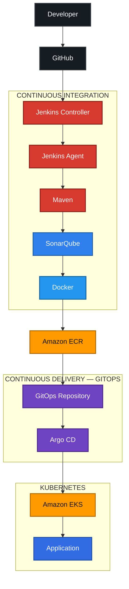

# JAVA-app-devops

End-to-end **CI/CD & GitOps Pipeline on AWS** — from source-code commit to Kubernetes deployment, using Jenkins, Maven, SonarQube, Docker, Amazon ECR, Argo CD, and Amazon EKS.

## Stack

- **GitHub** — Source Control
- **Jenkins** — CI/CD Automation
- **Maven** — Build & Test
- **SonarQube** — Static Code Analysis
- **Docker** — Containerization
- **Amazon ECR** — Container Registry
- **Argo CD** — GitOps Deployment
- **Amazon EKS** — Kubernetes Orchestration

## Architecture Flow

## Pipeline

1. The application source code is pushed to GitHub, triggering Jenkins.
2. Jenkins builds and tests the application with Maven, performs static code analysis with SonarQube, builds the Docker image, and pushes it to Amazon ECR.
3. The Kubernetes manifests are maintained in a GitOps repository. Argo CD monitors the repository and synchronizes the declared state with the Amazon EKS cluster.
4. The application is then deployed and managed as Kubernetes workloads running on EKS.

**Flow:** GitHub → Jenkins → Maven → SonarQube → Docker → Amazon ECR → GitOps Repository → Argo CD → Amazon EKS → Application

## Infrastructure

- Jenkins Controller
- Jenkins Agent
- Amazon EC2
- Amazon EKS / Kubernetes workloads
- GitOps repository

## Goal

Demonstrate an end-to-end CI/CD + GitOps workflow on AWS, from source-code commit to Kubernetes deployment.