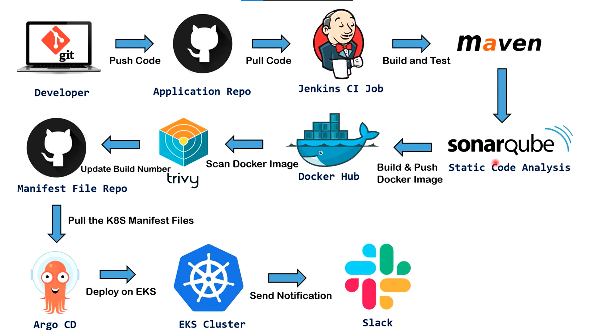

# JAVA-app-devops

End-to-end **CI/CD & GitOps Pipeline on AWS** from source code commit to Kubernetes deployment using Jenkins, Maven, SonarQube, Docker, Amazon ECR, Argo CD, and Amazon EKS.

## Stack

• **GitHub** - Source Control  
• **Jenkins** - CI/CD Automation  
• **Maven** - Build & Test  
• **SonarQube** - Static Code Analysis  
• **Docker** - Containerization  
• **Amazon ECR** - Container Registry  
• **Argo CD** - GitOps Deployment  
• **Amazon EKS** - Kubernetes Orchestration  
• **Amazon EC2** - Jenkins Infrastructure

## Architecture Flow

## Pipeline

1. Source code is pushed to the **GitHub application repository**.
2. **Jenkins** pulls the code and starts the CI pipeline.
3. **Maven** builds and tests the Java application.
4. **SonarQube** performs static code analysis.
5. **Docker** builds the application image.
6. The image is pushed to **Amazon ECR**.
7. Kubernetes manifests are maintained in the **GitOps repository**.
8. **Argo CD** monitors the GitOps repository and synchronizes the desired state.
9. **Argo CD** deploys the application to **Amazon EKS**.
10. The application runs as **Kubernetes workloads inside the EKS cluster**.

## Flow

**GitHub → Jenkins → Maven → SonarQube → Docker → Amazon ECR → GitOps Repository → Argo CD → Amazon EKS → Application**

## Infrastructure

• **Jenkins Controller** - Amazon EC2  
• **Jenkins Agent** - Amazon EC2  
• **Amazon ECR** - Container Image Registry  
• **Amazon EKS** - Kubernetes Cluster  
• **GitOps Repository** - Kubernetes Manifests  
• **Argo CD** - GitOps Synchronization

## Goal

Demonstrate an end-to-end **CI/CD + GitOps workflow on AWS**, from source code commit to Kubernetes deployment.
