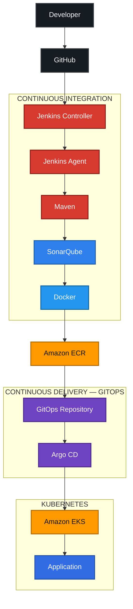

register-app
 
Test93

## CI/CD Pipeline

```mermaid
flowchart TB
    DEV["Developer"]
    GH["GitHub"]
    subgraph CI["CONTINUOUS INTEGRATION"]
        direction TB
        JC["Jenkins Controller"]
        JA["Jenkins Agent"]
        MAVEN["Maven"]
        SONAR["SonarQube"]

        DOCKER["Docker"]
    end
    ECR["Amazon ECR"]
    subgraph CD["CONTINUOUS DELIVERY — GITOPS"]
        direction TB
        GITOPS["GitOps Repository"]
        ARGO["Argo CD"]
    end
    subgraph K8S["KUBERNETES"]
        direction TB
        EKS["Amazon EKS"]
        APP["Application"]
    end
    DEV --> GH
    GH --> JC
    JC --> JA
    JA --> MAVEN
    MAVEN --> SONAR
    SONAR --> DOCKER
    DOCKER --> ECR
    ECR --> GITOPS
    GITOPS --> ARGO
    ARGO --> EKS
    EKS --> APP
    classDef source fill:#161b22,stroke:#30363d,color:#fff,stroke-width:2px
    classDef ci fill:#d73a2f,stroke:#8b1e17,color:#fff,stroke-width:2px
    classDef sonar fill:#2f80ed,stroke:#1d5fa7,color:#fff,stroke-width:2px
    classDef docker fill:#2496ed,stroke:#1265a0,color:#fff,stroke-width:2px
    classDef aws fill:#ff9900,stroke:#b36b00,color:#111,stroke-width:2px
    classDef gitops fill:#6f42c1,stroke:#4c288c,color:#fff,stroke-width:2px
    classDef k8s fill:#326ce5,stroke:#1d4fa3,color:#fff,stroke-width:2px
    class DEV,GH source
    class JC,JA,MAVEN ci
    class SONAR sonar
    class DOCKER docker
    class ECR,EKS aws
    class GITOPS,ARGO gitops
    class APP k8s
```

